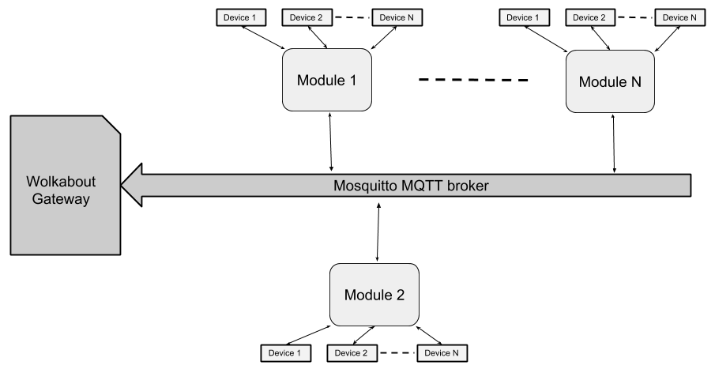

```
██╗    ██╗ ██████╗ ██╗     ██╗  ██╗ ██████╗  █████╗ ████████╗███████╗██╗    ██╗ █████╗ ██╗   ██╗
██║    ██║██╔═══██╗██║     ██║ ██╔╝██╔════╝ ██╔══██╗╚══██╔══╝██╔════╝██║    ██║██╔══██╗╚██╗ ██╔╝
██║ █╗ ██║██║   ██║██║     █████╔╝ ██║  ███╗███████║   ██║   █████╗  ██║ █╗ ██║███████║ ╚████╔╝ 
██║███╗██║██║   ██║██║     ██╔═██╗ ██║   ██║██╔══██║   ██║   ██╔══╝  ██║███╗██║██╔══██║  ╚██╔╝  
╚███╔███╔╝╚██████╔╝███████╗██║  ██╗╚██████╔╝██║  ██║   ██║   ███████╗╚███╔███╔╝██║  ██║   ██║   
 ╚══╝╚══╝  ╚═════╝ ╚══════╝╚═╝  ╚═╝ ╚═════╝ ╚═╝  ╚═╝   ╚═╝   ╚══════╝ ╚══╝╚══╝ ╚═╝  ╚═╝   ╚═╝   
                                                                                                  
```
----
WolkGateway bridges communication between WolkAbout IoT platform and multiple devices connected to it.

WolkGateway supports bridging of devices using following protocol(s):

* Json protocol

Installing from source
----------------------

This repository must be cloned from the command line using:
```sh
git clone --recurse-submodules https://github.com/Wolkabout/WolkGateway.git
```

Prerequisite
------

Following tools are required in order to build WolkGateway

* CMake - version 3.5 or later
* Conan
* Mosquitto MQTT broker
* Python
* Python PIP
* Optional: Docker CE (For running WolkGateway inside Docker container)

Former can be installed on Debian based system from terminal by invoking:

`apt-get install mosquitto cmake python python-pip && pip install conan`

Building
------

Before proceeding with steps from this section complete steps listed in 'Prerequisite' section.

1. Generate build system by invoking `./configure` from within WolkGateway base directory.
Build system is generated to `out` directory
2. Change current directory to `out`. Following steps are performed from within this directory
3. Build WolkGateway by invoking `make all -j6`
4. Run WolkGateway tests by invoking `tests`

Running
------

Before proceeding with steps from this section complete steps listed in 'Building' section.

1. Change current directory to `out`
2. Open `gatewayConfiguration.json` and fill name, key and password fields with data provided by WolkAbout IoT platform after gateway device creation
3. Make sure mosquitto is running by invoking `systemctl start mosquitto`
4. Run gateway by invoking `./WolkGatewayApp gatewayConfiguration.json`


Connecting devices
------

Devices are connected to the gateway using modules. Module must implement communication protocol for specific device and manage
all communication between devices and the gateway including sending device data and registering devices to WolkAbout platform.

Module communicates with gateway via local mqtt broker which is run along with gateway.

A single Module may handle multiple devices, and there may be multiple modules deployed.

[WolkGatewayModule-Cpp](https://github.com/Wolkabout/WolkGatewayModule-Cpp) is a SDK which implements data handling and device registration with the gateway,
and the user needs to implement communication with the devices.

Module may be implemented in any desired language as a mqtt client.

<p align="center">
  
</p>


Deleting devices
------

Gateway keeps track of all devices that are registered via modules. Keys of all registered devices are stored in a file existingDevices.json which is located
in the same directory as gateway executable.

To delete device from gateway open existingDevices.json file and remove the line containing the key of device which should be deleted, and restart gateway.
Upon starting the gateway will delete all registered devices whoose keys no longer appear in existingDevices.json file.

Note that the device will be registered again if the gateway receives registration request for that device from module.
